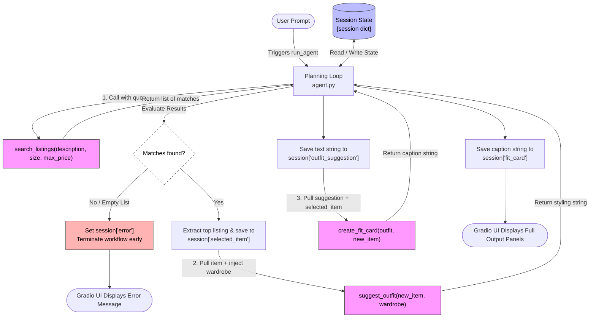

# FitFindr — Starter Kit

This starter kit contains everything you need to begin Project 2.

## Flowchart


 
## What's Included

```
ai201-project2-fitfindr-starter/
├── data/
│   ├── listings.json          # 40 mock secondhand listings
│   └── wardrobe_schema.json   # Wardrobe format + example wardrobe
├── utils/
│   └── data_loader.py         # Helper functions for loading the data
├── planning.md                # Your planning template — fill this out first
└── requirements.txt           # Python dependencies
```

## Setup

```bash
pip install -r requirements.txt
```

Set your Groq API key in a `.env` file (get a free key at [console.groq.com](https://console.groq.com)):
```
GROQ_API_KEY=your_key_here
```

## The Mock Listings Dataset

`data/listings.json` contains 40 mock secondhand listings across categories (tops, bottoms, outerwear, shoes, accessories) and styles (vintage, y2k, grunge, cottagecore, streetwear, and more).

Each listing has: `id`, `title`, `description`, `category`, `style_tags`, `size`, `condition`, `price`, `colors`, `brand`, and `platform`.

Load it with:
```python
from utils.data_loader import load_listings
listings = load_listings()
```

## The Wardrobe Schema

`data/wardrobe_schema.json` defines the format your agent uses to represent a user's existing wardrobe. It includes:

- `schema`: field definitions for a wardrobe item
- `example_wardrobe`: a sample wardrobe with 10 items you can use for testing
- `empty_wardrobe`: a starting template for a new user

Load an example wardrobe with:
```python
from utils.data_loader import get_example_wardrobe
wardrobe = get_example_wardrobe()
```

## Where to Start

1. **Read `planning.md` and fill it out before writing any code.**
2. Verify the data loads correctly by running `python utils/data_loader.py`.
3. Build and test each tool individually before connecting them through your planning loop.

Your implementation files go in this same directory. There's no required file structure for your agent code — organize it however makes sense for your design.

---

## Tool Inventory

### `search_listings(description, size, max_price)`

**Purpose:** Searches the 40-listing mock dataset for secondhand items that match what the user is looking for. Filters by price and size first, then scores and ranks remaining listings by how many of the user's keywords appear in each item's title, description, and style tags.

**Inputs:**
- `description` (str) — plain-English keywords describing what the user wants (e.g. `"vintage graphic tee"`)
- `size` (str | None) — clothing size to filter by (e.g. `"M"`); case-insensitive substring match so `"M"` matches `"S/M"`; `None` skips size filtering
- `max_price` (float | None) — price ceiling, inclusive; `None` skips price filtering

**Output:** `list[dict]` — matching listing dicts sorted best-match first. Each dict has `id`, `title`, `description`, `category`, `style_tags`, `size`, `condition`, `price`, `colors`, `brand`, and `platform`. Returns an empty list if nothing matches — never raises.

---

### `suggest_outfit(new_item, wardrobe)`

**Purpose:** Uses the Groq LLM (llama-3.3-70b-versatile) to suggest one or two complete outfit combinations built around a thrifted item. If the user's wardrobe is empty it falls back to general styling advice (silhouettes, textures, footwear categories) instead of wardrobe-specific pairings.

**Inputs:**
- `new_item` (dict) — a listing dict for the item the user is considering buying
- `wardrobe` (dict) — the user's wardrobe with an `"items"` key containing a list of clothing pieces; the list may be empty

**Output:** `str` — a structured plain-text styling breakdown. With a populated wardrobe this is two labeled outfit blueprints (aesthetic name, wardrobe pieces used, how to style). With an empty wardrobe this is a general layout (recommended silhouette, complementary textures, ideal footwear). Never returns an empty string — catches LLM errors and returns a descriptive message instead.

---

### `create_fit_card(outfit, new_item)`

**Purpose:** Turns the outfit suggestion and item details into a 2–4 sentence social-media caption suitable for Instagram or TikTok. Uses a higher LLM temperature (0.9) so output feels fresh and different each run.

**Inputs:**
- `outfit` (str) — the outfit suggestion string returned by `suggest_outfit`
- `new_item` (dict) — the listing dict for the thrifted item; used to pull the item name, price, and platform into the caption

**Output:** `str` — a casual, lowercase-styled caption that mentions the item name, price, and platform each exactly once. Returns a descriptive error string (not an exception) if `outfit` is empty or whitespace-only.

---

## Planning Loop

`run_agent()` in `agent.py` runs a fixed, sequential four-step loop — each step's output feeds the next:

1. **Parse the query** using regex to extract a size token (e.g. `size M`) and a price token (e.g. `under $30`). Both are stripped from the query so the remaining text becomes a clean `description`. Parsed values are saved to `session["parsed"]`.

2. **Search** — calls `search_listings(description, size, max_price)`. If the result list is empty the loop sets `session["error"]` to a user-friendly message and returns immediately. `suggest_outfit` is never called with empty input.

3. **Style** — takes `session["search_results"][0]` (the top-ranked listing) as `selected_item` and calls `suggest_outfit(selected_item, wardrobe)`. The result is saved to `session["outfit_suggestion"]`.

4. **Caption** — calls `create_fit_card(outfit_suggestion, selected_item)` and saves the result to `session["fit_card"]`. The completed session is returned.

The loop knows it is done when `create_fit_card` returns and all three output fields are populated. The only conditional branch is the early-exit after step 2; every other step always runs.

---

## State Management

A single `session` dict is initialized at the top of `run_agent()` via `_new_session(query, wardrobe)`. It holds every piece of state for one interaction:

| Key | Set by | Used by |
|-----|--------|---------|
| `query` | `_new_session` | logging / debugging |
| `parsed` | query-parsing block | `search_listings` call |
| `search_results` | `search_listings` | item selection |
| `selected_item` | item selection | `suggest_outfit`, `create_fit_card`, UI |
| `wardrobe` | `_new_session` | `suggest_outfit` |
| `outfit_suggestion` | `suggest_outfit` | `create_fit_card`, UI |
| `fit_card` | `create_fit_card` | UI |
| `error` | early-exit block | UI (checked before anything else) |

No global state is used. Each call to `run_agent()` gets a completely fresh session, so concurrent requests cannot interfere with each other.

---

## Error Handling

| Tool | Failure mode | Agent response | Concrete example from testing |
|------|-------------|----------------|-------------------------------|
| `search_listings` | No listings match the query | Sets `session["error"]` to a helpful message and returns the session immediately — `suggest_outfit` and `create_fit_card` are never called | Query `"designer ballgown size XXS under $5"` → no listings pass both the $5 price filter and the XXS size filter → error: `"Sorry, I couldn't find any listings matching your search. Try broader keywords, skip the size filter, or raise your price limit."` |
| `suggest_outfit` | Wardrobe is empty | Switches to a general-styling prompt branch; the LLM returns silhouette, texture, and footwear guidance instead of wardrobe-specific pairings — never returns an empty string | Query `"vintage graphic tee under $30"` with `Empty wardrobe` selected → response switched to general layout: `"RECOMMENDED SILHOUETTE: … COMPLEMENTARY TEXTURES: … IDEAL FOOTWEAR CATEGORY: …"` |
| `create_fit_card` | `outfit` string is empty or whitespace-only | Returns `"Error: Cannot generate a fit card because the outfit suggestion is missing or empty."` — no exception raised | Calling `create_fit_card("", item)` directly returns the error string cleanly; the Gradio panel shows it instead of crashing |

---

## Spec Reflection

The biggest design decision that differed from the original spec was **query parsing**. The planning doc left this open ("regex, string splitting, or ask the LLM"). I chose regex because it is deterministic, has zero latency, and requires no extra API call for a structured extraction task. The tradeoff is brittleness; the pattern `\bsize\s+([A-Z]{1,3})\b` won't catch phrasing like `"I wear a medium"`. For a production version an LLM-based extraction step would handle more natural phrasings, but regex is the right call for a mock dataset with predictable query formats.

The second decision was the `suggest_outfit` prompt structure. The first version returned long conversational paragraphs that were hard to read in the Gradio text panel and used `**bold**` markdown that rendered as raw asterisks. I revised the system prompt to enforce a rigid, labeled blueprint format (`OUTFIT 1: [AESTHETIC NAME]`, `- WARDROBE PIECES:`, etc.) which made the output consistently scannable, easier to read/test and worked correctly in a plain-text box.

---

## AI Usage

### Instance 1 — Implementing `search_listings`

**What I gave Claude:** The Tool 1 section of `planning.md` (inputs with types, return value description, the four-step TODO in the docstring) plus the `load_listings()` signature from `data_loader.py`.

**What it produced:** A complete implementation that loaded all listings, filtered by price and size, scored by keyword overlap, dropped zero-score listings, and sorted descending by score.

**What I changed before using it:** The initial version used `l['size']` without a `.get()` guard, which would have crashed on any listing missing the size field. I added `l.get('size', '')` to make it safe. I also noticed the size match used exact equality (`l['size'].lower() == size_lower`) instead of substring containment, which would have rejected `"S/M"` when the user typed `"M"`. I changed it to `size_lower in l['size'].lower()` to match the spec's note about case-insensitive substring matching.

### Instance 2 — Implementing the `run_agent` planning loop

**What I gave Claude:** The full Architecture Mermaid diagram from `planning.md` (the flowchart showing session state, the `C1` branch on empty results, and the three sequential tool calls), the Planning Loop and State Management prose sections, and the `_new_session` dict definition already in `agent.py`.

**What it produced:** A complete `run_agent()` body with regex-based query parsing, the early-exit guard after `search_listings`, sequential calls to `suggest_outfit` and `create_fit_card`, and all results written back into the session dict.

**What I changed before using it:** The regex for price extraction (`\$?(\d+)`) initially matched bare numbers anywhere in the query — the word `"30s"` in a query like `"1930s jacket"` would have been parsed as `max_price=30`. I tightened the pattern to require an explicit `$` sign or the word `under` immediately before the number, and added the `\b` word-boundary anchor to avoid partial matches inside other words.
