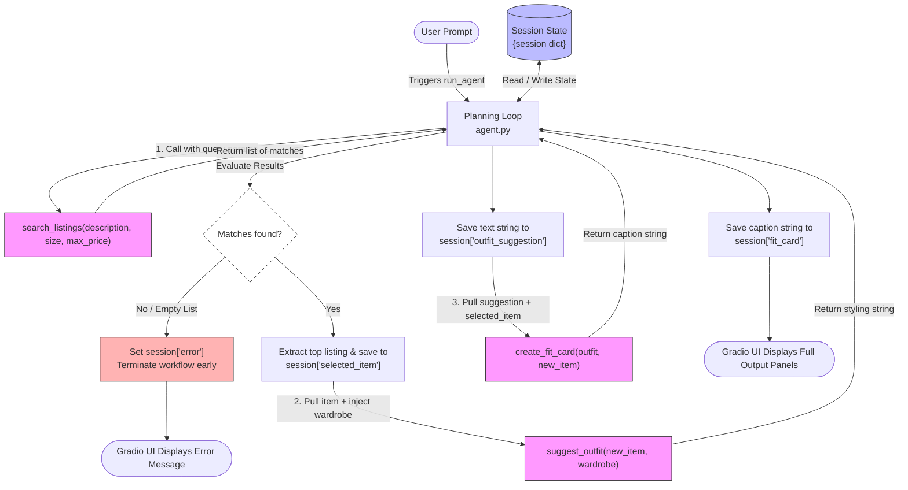

# FitFindr — planning.md

> Complete this document before writing any implementation code.
> Your spec and agent diagram are what you'll use to direct AI tools (Claude, Copilot, etc.) to generate your implementation — the more specific they are, the more useful the generated code will be.
> Your planning.md will be reviewed as part of your submission.
> Update it before starting any stretch features.

---

## Tools

List every tool your agent will use. For each tool, fill in all four fields.
You must have at least 3 tools. The three required tools are listed — add any additional tools below them.

### Tool 1: search_listings

**What it does:**
Searches the thrift/resale listings for items that match what the user is looking for. It filters by price and size, then ranks results by how well the item descriptions match the user's keywords.

**Input parameters:**
- `description` (str): Keywords describing what the user wants, in plain English.
- `size` (str): The clothing size to filter by, like "M" or "L" — optional.
- `max_price` (float): The highest price the user is willing to pay — optional.

**What it returns:**
A list of matching listings sorted from best match to worst. Each listing includes the item's title, description, category, style tags, size, condition, price, colors, brand, and which resale platform it's on. Returns an empty list if nothing matches so it never crashes.

**What happens if it fails or returns nothing:**
If no listings match, the agent tells the user no results were found and suggests they try broader keywords, skip the size filter, or raise their price limit.

---

### Tool 2: suggest_outfit

**What it does:**
Takes a thrifted item the user is considering and their existing wardrobe, then uses the AI model to suggest one or two complete outfits they could build around it. If the wardrobe is empty, it gives general styling advice instead.

**Input parameters:**
- `new_item` (dict): The listing the user is interested in — includes its title, style tags, colors, category, etc.
- `wardrobe` (dict): The user's saved wardrobe, which has an "items" key containing a list of clothing pieces they already own. Can be empty.

**What it returns:**
A plain-text string with outfit suggestions, either specific combinations using pieces from the wardrobe, or general styling ideas if no wardrobe items exist.

**What happens if it fails or returns nothing:**
If the wardrobe is empty, the agent still responds with general advice about what kinds of items pair well with the new piece (e.g., "this would look great with wide-leg trousers and loafers"). It never returns an empty response or crashes.

---

### Tool 3: create_fit_card

**What it does:**
Takes the outfit suggestion and the thrifted item's details and generates a short, social-media-style caption for the look — like something you'd post on Instagram or TikTok with an outfit photo.

**Input parameters:**
- `outfit` (str): The outfit suggestion text returned by suggest_outfit.
- `new_item` (dict): The listing dict for the thrifted item, used to pull in the item name, price, and platform naturally into the caption.

**What it returns:**
A 2–4 sentence caption string written in a casual, authentic tone. It mentions the item name, price, and platform once each, and captures the overall vibe of the outfit.

**What happens if it fails or returns nothing:**
If the outfit string is empty or missing, the tool returns a descriptive error message string explaining that no outfit suggestion was available to build a caption from — it never crashes or returns a blank response.

---

### Additional Tools (if any)

<!-- Copy the block above for any tools beyond the required three -->

---

## Planning Loop

**How does your agent decide which tool to call next?**
<!-- Describe the logic your planning loop uses. What does it look at? What conditions change its behavior? How does it know when it's done? -->

First of all the plannig loop look strictly at search_listings(), this is a non-negotiable and if there is an error it and returns early - otherwise, it returns the results[0] and proceeds to call suggest_outfit(), then it checks if there are items in the user's wardrobe and returns a potential outfit the user could use - if there are no items in the user's wardrobe then it suggests a general outfit the user could use (what kinds of items pair well, what vibe it suits, etc.). Then it calls create_fit_card() and it creates a casual and authentic caption the user can use - if there is an error it returns a descriptive error message not an exception so the user knows what is wrong. And depending on what scenario happens the agent returns the data to the user.

---

## State Management

**How does information from one tool get passed to the next?**
<!-- Describe how your agent stores and accesses state within a session. What data is tracked? How is it passed between tool calls? -->

There is a session dictionary that is initialized at the start of the agent loop, after each tool is called by the agent, the data from the tool is returned and passed into the session dictionary so that the agent passes the data for the next tool to use it until the loop is done.

---

## Error Handling

For each tool, describe the specific failure mode you're handling and what the agent does in response.

| Tool | Failure mode | Agent response |
|------|-------------|----------------|
| search_listings | No results match the query | Tool returns an empty list -> loop is stopped and the agent retrieves that information and tells the user "Sorry, I could not find any item that matches your interests, would you like anything else?"|
| suggest_outfit | Wardrobe is empty | The agent gets the data that the wardrobe is empty, however, the agent tries to suggest an outfit with general styling ideas. |
| create_fit_card | Outfit input is missing or incomplete | Returns a descriptive error message string - it does not raise an exception. |

---

## Architecture

<!-- Draw a diagram of your agent showing how the components connect:
     User input → Planning Loop → Tools (search_listings, suggest_outfit, create_fit_card)
                                                                          ↕
                                                                   State / Session
     Show what triggers each tool, how state flows between them, and where error paths branch off.
     ASCII art, a Mermaid diagram (https://mermaid.js.org/syntax/flowchart.html), or an embedded
     sketch are all fine. You'll share this diagram with an AI tool when asking it to implement
     the planning loop and each individual tool. -->
---

---

## AI Tool Plan

<!-- For each part of the implementation below, describe:
     - Which AI tool you plan to use (Claude, Copilot, ChatGPT, etc.)
     - What you'll give it as input (which sections of this planning.md, your agent diagram)
     - What you expect it to produce
     - How you'll verify the output matches your spec before moving on

     "I'll use AI to help me code" is not a plan.
     "I'll give Claude my Tool 1 spec (inputs, return value, failure mode) and ask it to implement
     search_listings() using load_listings() from the data loader — then test it against 3 queries
     before trusting it" is a plan. -->

**Milestone 3 — Individual tool implementations:**

I'll give Claude my Tool 1 search_listings("vintage graphic tee", size="M", max_price=30.0) and ask it to implement search_listings() using load_listings() from the data loader — then test it against 3 queries before trusting it - while trying to test out edge cases".

I'll give Claude my Tool 2 to implement suggest_outfit(new_item, wardrobe). I will provide the required system prompt guidelines and explicitly tell it to handle an empty wardrobe case by generating general styling advice that makes sense. I'll verify it by passing a valid item alongside a completely empty wardrobe to ensure the LLM handles it gracefully and returns a helpful text response instead of throwing a KeyError.

I'll give Claude my Tool 3 spec to implement create_fit_card(outfit, new_item) using the Groq LLM to generate short, casual, social media captions. I will tell it to include a defensive check that catches empty input strings and returns a clean error string. I'll verify the output by running the function three times in a row with the exact same inputs to make sure the LLM configuration is set correctly to give me distinct, creative captions every time that align with the information that is passed into it from the previous steps.

**Milestone 4 — Planning loop and state management:**

I'll give Claude my text-based Mermaid architecture diagram and the planning loop conditional branching details from this planning.md file. I'll ask it to help me implement the run_agent() function in agent.py to manage the execution flow and sequentially update the session dictionary. I'll verify the code line-by-line to guarantee that it checks the search_listings output first and entirely skips calling suggest_outfit if no matching items are found, saving an error message to the session state instead. And then checking the successful and error outputs for the suggest_outfit() and create_fit_card().

---

## A Complete Interaction (Step by Step)

Write out what a full user interaction looks like from start to finish — tool call by tool call. Use a specific example query.

**Example user query:** "I'm looking for a vintage graphic tee under $30. I mostly wear baggy jeans and chunky sneakers. What's out there and how would I style it?"

**Step 1:**
<!-- What does the agent do first? Which tool is called? With what input? -->
The agent looks at the available tools and finds that search_listings() is the first one that it needs to call, with the input search_listings("vintage graphic tee", size="M", max_price=30.0) then it returns the top matches if there are listings, if not it handles the errors gracefully.

**Step 2:**
<!-- What happens next? What was returned from step 1? What tool is called now? -->

FitFindr picks the top result: "Faded Band Tee — $22, Depop, Good condition." And then the agent decides to call suggest_outfit(new_item=<band tee>, wardrobe=<user's wardrobe>) so that it takes the item that the previous tool returned and looks at the current user's wardrobe and it returns a suggested outfit, could be null so it handles it gracefully.

**Step 3:**
<!-- Continue until the full interaction is complete -->

Then it calls create_fit_card(outfit=<suggestion>, new_item=<band tee>) so that it takes the results from the two previous tools and creates a shareable description of the outfit with the new item that the agent picked.

**Final output to user:**
<!-- What does the user actually see at the end? -->

At the end if all tools worked and there was not missing data, the user sees the result of create_fit_card() as mentioned above, otherwise, the user will see the error that happened without the application crashing.
